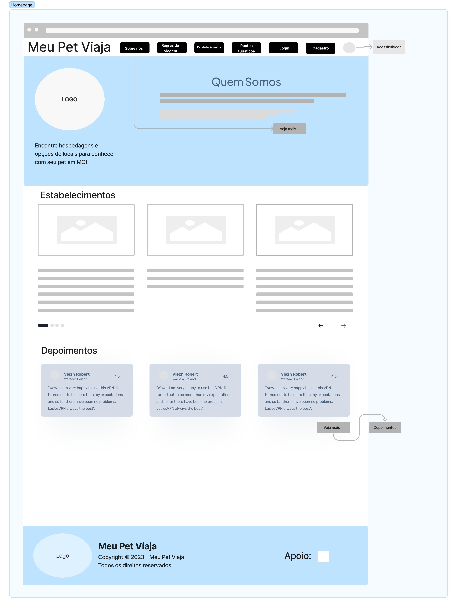
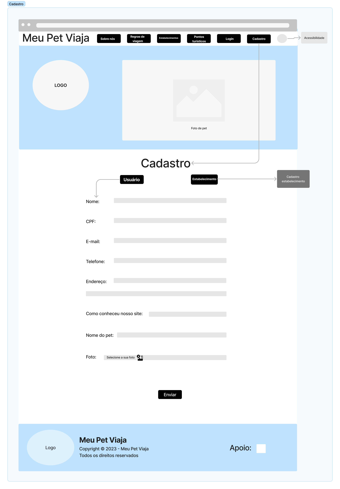

# Projeto de Interface

Visão geral da interação do usuário pelas telas do sistema e protótipo interativo das telas com as funcionalidades que fazem parte do sistema (wireframes).

 Apresente as principais interfaces da plataforma. Discuta como ela foi elaborada de forma a atender os requisitos funcionais, não funcionais e histórias de usuário abordados nas <a href="2-Especificação do Projeto.md"> Documentação de Especificação</a>.

## User Flow

Fluxo de usuário (User Flow) é uma técnica que permite ao desenvolvedor mapear todo fluxo de telas do site ou app. Essa técnica funciona para alinhar os caminhos e as possíveis ações que o usuário pode fazer junto com os membros de sua equipe.

> **Links Úteis**:
> - [User Flow: O Quê É e Como Fazer?](https://medium.com/7bits/fluxo-de-usu%C3%A1rio-user-flow-o-que-%C3%A9-como-fazer-79d965872534)
> - [User Flow vs Site Maps](http://designr.com.br/sitemap-e-user-flow-quais-as-diferencas-e-quando-usar-cada-um/)
> - [Top 25 User Flow Tools & Templates for Smooth](https://www.mockplus.com/blog/post/user-flow-tools)

## Wireframes

### Homepage

A homepage apresenta todas as seções do site (sobre nós, regras de viagem, estabelecimentos, pontos turísticos, login e cadastro) que podem ser acessadas através dos botões localizados no menu navegação e os depoimentos cuja página pode ser acessada através do botão "Veja mais +" localizado no card "Depoimentos" no final da página. No menu navegação, haverá uma opção de acessibilidade, conforme RNF-002. No card superior, logo abaixo do menu navegação, haverá um resumo das informações do projeto e um botão "Veja mais +" que redirecionará o usuário para a página "Sobre nós" e a logo do projeto. Mais abaixo terá um card com algumas opções de estabelecimentos. O layout da homepage determinará o layout das demais seções do site. No rodapé da homepage, encontram-se os direitos de uso do site, bem como a instituição de apoio do projeto.

### Sobre nós

### Regras

### Estabelecimentos

### Pontos turísticos

### Login

### Cadastro

Quando o usuário clicar no botão "Cadastro" localizado no menu navegação da Homepage, será redirecionado para a página "Cadastro". A página apresenta o mesmo menu navegação da homepage e o card do topo da página possui a logo e uma foto de um pet. Mais abaixo, o usuário conseguirá preencher seus dados cadastrais, fazer o upload de uma foto e enviar as informações através de um botão. No rodapé da página, constam os direitos de uso e a instituição de apoio do projeto.

### Depoimentos

Quando o usuário clicar no botão "Veja mais +", localizado no card "Depoimentos" da Homepage, será redirecionado para a página "Depoimentos". A página apresenta o mesmo menu navegação da Homepage e o card no topo da página possui a logo e uma foto de um pet. Mais abaixo, haverá um formulário onde o usuário poderá deixar seu depoimento sobre algum estabelecimento ou ponto turístico estando logado (o nome e a foto já estarão carregados) ou de forma anônima, conforme RF-007 e RF-012. Ao lado do formulário, aparecerão depoimentos de outros ou do próprio usuário, com a opção para curtir e comentar, conforme RF-013.

